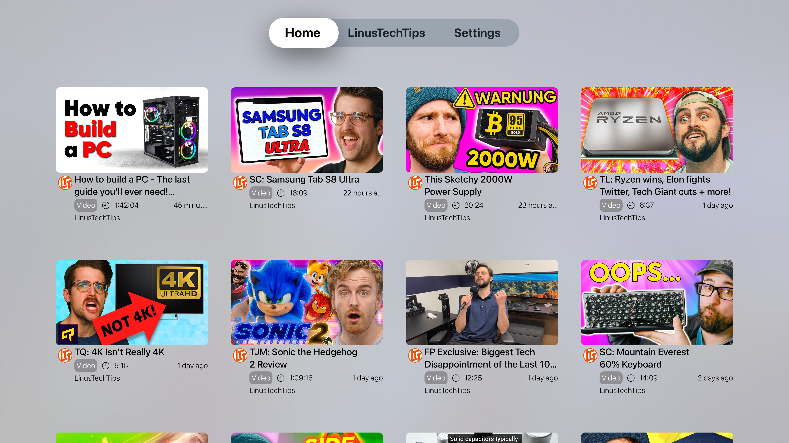

<h1 align="center">Wasserflug</h1>

[](https://apps.apple.com/us/app/ru-eating/id6692608792?platform=iphone)

An unofficial [Floatplane](https://www.floatplane.com/) client for tvOS written in **Swift** using **SwiftUI**.

> [!WARNING]
> The App Store version is currently outdated. Using the TestFlight version is recommended.

> [!TIP]
> Check out [Hydravion](https://github.com/bmlzootown/Hydravion) for Roku and [Hydravion-AndroidTV](https://github.com/bmlzootown/Hydravion-AndroidTV) for Android TV

## Screenshots

<div display="flex">
  
  
  
</div>

## Features

- [x] Floatplane Login with two-factor authentication
  - [ ] Login via LTT Forum/Discord (See [FAQs](#frequently-asked-questions))
- [x] Aggregated home screen1
- [x] Creator screens with proper branding (banner image, profile picture, "About" information)
  - [x] Search a creator for videos
  - [x] Creator Livestream
  - [x] Channel support (branding, search, etc.)
- [x] Floatplane tags (view only)
- [x] Formatted post descriptions
- [x] 4K Support
- [x] Watch progress (syncs with Floatplane website)
- [x] Attachment views
  - [x] Videos
  - [x] Pictures
  - [ ] Audio
  - [ ] Gallery
- [ ] Livestream chat
- [ ] Notifications
- [ ] Creator discovery
- [ ] Picture-in-picture
- [ ] Buttons for searching by tags

> [!NOTE]
> You can manually search a tag by typing a `#` before the tag name

## Frequently Asked Questions

**Q: How do I login using my  LinusTechTips Forums account?**

A: When you log in to Floatplane using a Discord or LTT Forum account, an account is made for you in Floatplane as well, with its own password and username (the username is usually copied from the other service). You were asked to create a Floatplane-specific password when you first logged in. This is the information you should use to log in to Wasserflug. If you have forgotten the Floatplane password for this account (because you normally use LTT Forum or Discord to log in), you can go onto the Floatplane website to change your password first.

**Q: I'm getting an error when logging in, "Logging in was successful, but an error was encountered while loading your user profile."? What do I do?**

A: This happens sometimes because of the differences between the LTT subscriptions and other content creators on Floatplane having slightly different data here and there. Let the app developer know over Discord or email and the issue can be sorted out quickly enough!

## Contributing

### TestFlight
If you are interested in beta testing Wasserflug, you can find it on [TestFlight](https://testflight.apple.com/join/aYwKPFNF).

### Building

1. Clone this repository
```shell
$ git clone https://github.com/jamamp/Wasserflug-tvOS
$ cd Wasserflug-tvOS
```
2. Open the project in Xcode
3. ...

## Legal
- Created by James Linnell
- Logo from [Shutterstock](https://www.shutterstock.com/image-vector/small-seaplane-isolated-vector-illustration-single-1091024861) copyrighted by Yaroslav Shkuro
